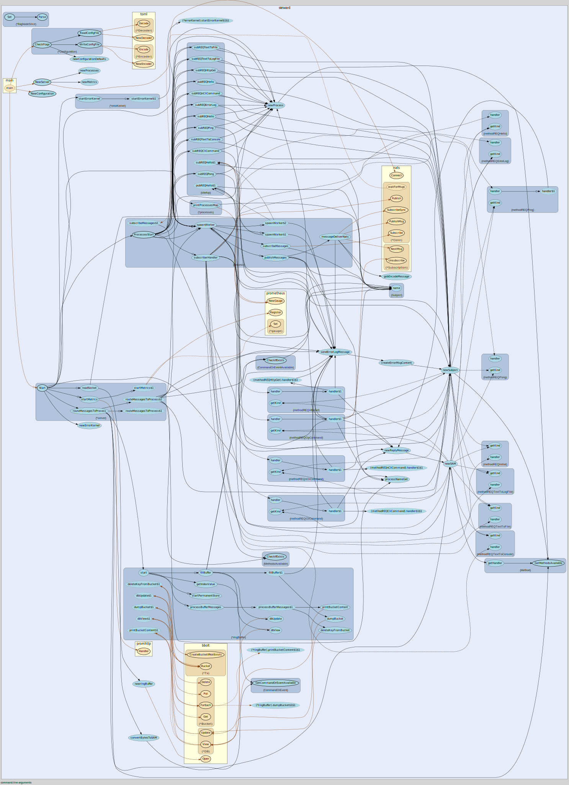

# steward

Command & Control systems that are either always online or occasionally available online. Similar to Servers or IOT platforms where the link for reaching them can be stable wire/fibre LAN connections, or not-always-connected satellite links or GSM connections, or devices available over WAN connections.

The idea behind Steward is to help out with exactly these issues, allowing you to handle the state of your servers/containers/nodes.

- [steward](#steward)
  - [What is it ?](#what-is-it-)
  - [Overview](#overview)
  - [Inspiration](#inspiration)
  - [Why](#why)
  - [Publishing and Subscribing processes](#publishing-and-subscribing-processes)
    - [Publisher](#publisher)
    - [Subscriber](#subscriber)
    - [All parts involved](#all-parts-involved)
    - [Logical structure](#logical-structure)
  - [Terminology](#terminology)
  - [Features](#features)
    - [Error messages from nodes](#error-messages-from-nodes)
    - [Message handling and threads](#message-handling-and-threads)
    - [Timeouts and retries](#timeouts-and-retries)
      - [REQRelay](#reqrelay)
    - [Flags and configuration file](#flags-and-configuration-file)
    - [Schema for the messages to send into Steward via the API's](#schema-for-the-messages-to-send-into-steward-via-the-apis)
    - [Request Methods](#request-methods)
      - [REQOpProcessList](#reqopprocesslist)
      - [REQOpProcessStart](#reqopprocessstart)
      - [REQOpProcessStop](#reqopprocessstop)
      - [REQCliCommand](#reqclicommand)
      - [REQCliCommandCont](#reqclicommandcont)
      - [REQToConsole](#reqtoconsole)
      - [REQTailFile](#reqtailfile)
      - [REQHttpGet](#reqhttpget)
      - [REQHello](#reqhello)
      - [REQErrorLog](#reqerrorlog)
    - [Request Methods used for reply messages](#request-methods-used-for-reply-messages)
      - [REQToConsole](#reqtoconsole-1)
      - [REQToFileAppend](#reqtofileappend)
      - [REQToFile](#reqtofile)
      - [ReqCliCommand](#reqclicommand-1)
    - [Errors reporting](#errors-reporting)
    - [Prometheus metrics](#prometheus-metrics)
    - [Other](#other)
  - [Howto](#howto)
    - [Build and Run](#build-and-run)
    - [Options for running](#options-for-running)
    - [How to Run](#how-to-run)
      - [Nkey Authentication](#nkey-authentication)
      - [nats-server (the message broker)](#nats-server-the-message-broker)
        - [Server config with nkey authentication](#server-config-with-nkey-authentication)
      - [Examples for running Steward](#examples-for-running-steward)
        - [Minimum config example](#minimum-config-example)
        - [More details config example](#more-details-config-example)
    - [Message fields explanation](#message-fields-explanation)
    - [How to send a Message](#how-to-send-a-message)
      - [Send to socket with netcat](#send-to-socket-with-netcat)
      - [Sending a command from one Node to Another Node](#sending-a-command-from-one-node-to-another-node)
        - [Example JSON for appending a message of type command into the `socket` file](#example-json-for-appending-a-message-of-type-command-into-the-socket-file)
        - [Specify more messages at once do](#specify-more-messages-at-once-do)
        - [Send the same message to several hosts by using the toHosts field](#send-the-same-message-to-several-hosts-by-using-the-tohosts-field)
        - [Send an Op Command message for process listing with custom timeout and amount of retries](#send-an-op-command-message-for-process-listing-with-custom-timeout-and-amount-of-retries)
        - [Send and Op Command to stop a subscriber on a node](#send-and-op-command-to-stop-a-subscriber-on-a-node)
        - [Send and Op Command to start a subscriber on a node](#send-and-op-command-to-start-a-subscriber-on-a-node)
        - [Tail a log file on a node, and save the result of the tail centrally at the directory specified](#tail-a-log-file-on-a-node-and-save-the-result-of-the-tail-centrally-at-the-directory-specified)
  - [Concepts/Ideas](#conceptsideas)
    - [Naming](#naming)
      - [Subject](#subject)
        - [Complete subject example](#complete-subject-example)
  - [TODO](#todo)
    - [Services at startup of Steward. Could be implemented by having a local folder of messages to go through at startup. What is needed](#services-at-startup-of-steward-could-be-implemented-by-having-a-local-folder-of-messages-to-go-through-at-startup-what-is-needed)
    - [Add Op option the remove messages from the queue on nodes](#add-op-option-the-remove-messages-from-the-queue-on-nodes)
  - [Disclaimer](#disclaimer)

## What is it ?

Command And Control anything like Servers, Containers, VM's or others by creating and sending messages with methods who will describe what to do. Steward will then take the responsibility for making sure that the message are delivered to the receiver, and that the method specified are executed with the given parameters defined. An example of a message.

An example of a **request method** to feed into the system. All fields are explained in detail further down in the document.

```json
[
    {
        "directory":"/var/cli/command_result/",
        "fileName": "some-file-name.result",
        "toNode": "ship1",
        "methodArgs": ["bash","-c","sleep 5 & tree ./"],
        "method":"REQCliCommand",
        "replyMethod":"REQToFileAppend",
        "ACKTimeout":5,
        "retries":3,
        "replyACKTimeout":5,
        "replyRetries":3,
        "methodTimeout": 10
    }
]
```

If the receiver `toNode` is down when the message was sent, it will be **retried** until delivered within the criterias set for `timeouts` and `retries`. The state of each message processed is handled by the owning steward instance where the message originated, and no state about the messages are handled in the message broker.

Since the initial connection from a Steward node is outbound towards the central message broker no inbound firewall openings are needed.

## Overview

Send Request Methods to control your servers by passing a messages that will have guaranteed delivery  based on the criteries set, and when/if the receiving node is available. The result of the method executed will be delivered back to you from the node you sent it from.

Examples of Request Methods:

- **Any** shell command or script of your own choice.
- HTTP Get.
- Tail log files.

Steward uses **NATS** as message passing architecture for the commands back and forth from nodes. Delivery is guaranteed within the criterias set. All of the processes in the system are running concurrently, so if something breaks or some process is slow it will not affect the handling and delivery of the other messages in the system.

A node can be a server running any host operating system, a container living in the cloud somewhere, a Rapsberry Pi, or something else that needs to be controlled that have an operating system installed.

Steward can be compiled to run on all major architectures like **x86**, **amd64**,**arm64**, **ppc64** and more, with for example operating systems like **Linux**, **OSX**, **Windows** and **Android**.

## Inspiration

The idea for how to handle processes, messages and errors are based on Joe Armstrongs idea behind Erlang described in his Thesis <https://erlang.org/download/armstrong_thesis_2003.pdf>.

Joe's document describes how to build a system where everything is based on sending messages back and forth between processes in Erlang, and where everything is done concurrently.

I used those ideas as inspiration for building a fully concurrent system to control servers or container based systems by passing  messages between processes asynchronously to execute methods, handle errors, or handle the retrying if something fails.

Steward is written in programming language Go with NATS as the message broker.

## Why

With existing solutions there is often either a push or a pull kind of setup to control the nodes.

In a push setup the commands to be executed is pushed to the receiver, but if a command fails because for example a broken network link it is up to you as an administrator to detect those failures and retry them at a later time until it is executed successfully.

In a pull setup an agent is installed at the Edge unit, and the configuration or commands to execute locally are pulled from a central repository. With this kind of setup you can be pretty certain that sometime in the future the node will reach it's desired state, but you don't know when. And if you want to know the current state you will need to have some second service which gives you that information.

In it's simplest form the idea about using an event driven system as the core for management of Edge units is that the sender/publisher are fully decoupled from the receiver/subscriber. We can get an acknowledge if a message is received or not, and with this functionality we will at all times know the current state of the receiving end.

## Publishing and Subscribing processes

All parts of the system like processes, method handlers, messages, error handling are running concurrently.

If one process hangs on a long running message method it will not affect the rest of the system.

### Publisher

1. A message in valid format is appended to the in socket.
1. The message is picked up by the system and put on a FIFO ringbuffer.
1. The method type of the message is checked, a subject is created based on the content of the message,  and a publisher process to handle the message type for that specific receiving node is started if it does not exist.
1. The message is then serialized to binary format, and sent to the subscriber on the receiving node.
1. If the message is expected to be ACK'ed by the subcriber then the publisher will wait for an ACK if the message was delivered. If an ACK was not received within the defined timeout the message will be resent. The amount of retries are defined within the message.

### Subscriber

1. The receiving end will need to have a subscriber process started on a specific subject and be allowed handle messages from the sending nodes to execute the method defined in the message.
1. When a message have been deserialized, it will lookup the correct handler for the method type specified within the message, and execute that handler.
1. If the output of the method called is supposed to be returned to the publiser it will do so by using the replyMethod specified, and pick up the next message in the queue.

### All parts involved



### Logical structure

TODO: Make a diagram here...

## Terminology

- **Node**: Something with an operating system that have network available. This can be a server, a cloud instance, a container, or other.
- **Process**: A message handler that knows how to handle messages of a given subject concurrently.
- **Message**:
  - **Command**: Something to be executed on the message received. An example can be a shell command.
  - **Event**: Something that have happened. An example can be transfer of syslog data from a host.

## Features

### Error messages from nodes

- Error messages will be sent back to the central error handler upon failure on a node.

```log
Tue Sep 21 09:17:55 2021, info: toNode: ship2, fromNode: central, method: REQOpProcessList: max retries reached, check if node is up and running and if it got a subscriber for the given REQ type
```

### Message handling and threads

- The handling of all messages is done by spawning up a process for handling the message in it's own thread. This allows us to down on the **individual message level** keep the state for each message both in regards to ACK's, error handling, send retries, and rerun of a method for a message if the first run was not successful.

- Processes for handling messages on a host can be **restarted** upon **failure**, or asked to just terminate and send a message back to the operator that something have gone seriously wrong. This is right now just partially implemented to test that the concept works, where the **action=no-action**.

- Publisher Processes on a node for handling new messages for new nodes will automatically be spawned when needed if it does not already exist.

- Messages not fully processed or not started yet will be automatically rehandled if the service is restarted since the current state of all the messages being processed are stored on the local node in a **key value store** until they are finished.

- All messages processed by a publisher will be written to a log file as they are processed, with all the information needed to recreate the same message if needed, or it can be used for auditing.

- All handling down to the process and message level are handled concurrently. So if there are problems handling one message sent to a node on a subject it will not affect the messages being sent to other nodes, or other messages sent on other subjects to the same host.

- Message types of both **ACK** and **NACK**, so we can decide if we want or don't want an Acknowledge if a message was delivered succesfully.
Example: We probably want an **ACK** when sending some **REQCLICommand** to be executed, but we don't care for an acknowledge **NACK** when we send an **REQHello** event.

### Timeouts and retries

- Default timeouts to wait for ACK messages and max attempts to retry sending a message are specified upon startup. This can be overridden on the message level.

- Timeouts can be specified on both the **message**, and the **method**.
  - A message can have a timeout.
  - If the method triggers a shell command, the command can have its own timeout, allowing process timeout for long/stuck commands, or for telling how long the command is supposed to run.

Example of a message with timeouts set:

```json
[
    {
        "directory":"/some/result/directory/",
        "fileName":"my-syslog.log",
        "toNode": "ship2",
        "methodArgs": ["bash","-c","tail -f /var/log/syslog"],
        "replyMethod":"REQToFileAppend",
        "method":"REQnCliCommandCont",
        "ACKTimeout":3,
        "retries":3,
        "methodTimeout": 60
    }
]
```

In the above example, the values set meaning:

- **ACKTimeout** : Wait 3 seconds for an **ACK** message.
- **retries** : If an **ACK** is not received, retry sending the message 3 times.
- **methodTimeout** : Let the bash command `tail -f ./tmp.log` run for 60 seconds before it is terminated.

#### REQRelay

Instead of injecting the new Requests on the central server, you can relay messages via another node as long as the NATS authorization conf permits it. This is what REQRelay is for.

Example:

```json
[
    {
        "directory":"/var/tail-logs/",
        "fileName": "my-wifi.log",
        "toNode": "node1",
        "relayViaNode": "central",
        "relayReplyMethod": "REQToConsole",
        "methodArgs": ["bash","-c","tail -f /var/log/wifi.log"],
        "method":"REQCliCommandCont",
        "replyMethod":"REQToFileAppend",
        "ACKTimeout":5,
        "retries":3,
        "replyACKTimeout":5,
        "replyRetries":3,
        "methodTimeout": 10
    }
]
```

```text
   Inject new                  Relay the message               Send actual REQ              
 Request message               to central server                  to node2                  
                                                                                            
        1                              2                              3                     
                 ┌─────────────┐                ┌─────────────┐              ┌─────────────┐
 ---------------▷│             │---------------▷│             │-------------▷│             │
                 │ node1       │                │ central     │              │ node2       │
 ◁---------------│             │◁---------------│             │◁-------------│             │
                 └─────────────┘                └─────────────┘              └─────────────┘
                                                                                            
        6                              5                              4                     
  Ececute reply                                                                             
 handler, f.ex.                Send relay reply                Send reply REQ               
 REQToConsole to                 REQ to origin                with result back              
 print to STDOUT                     node                                                   
```

Steps Explained:

1. On **node1**, inject a message like in the example above.
2. The message will then be relayed to the node in the `relayViaNode` field.
  On **central** the actual request **method** and **toNode** specified will be checked, and forwarded to node2.
3. Node2 recevies the request, and executed the method with the arguments specified.
4. The result is sent back to **central** where it is handled according to the **replyMethod** specified.
5. A copy of the reply message will also be created on **central**, and forwarded to **node1** where it originated.
6. On **node1** the **relayReplyMethod** is used to check what to do with the message. In this case it is printed to the consoles STDOUT.

### Flags and configuration file

Steward supports both the use of flags/arguments set at startup, and the use of a config file.

- A default config file will be created at first startup if one does not exist
  - The default config will contain default values.
  - Any value also provided via a flag will also be written to the config file.
- If **Steward** is restarted, the current content of the config file will be used as the new defaults.
  - If you restart Steward without any flags specified, the values of the last run will be read from the config file.
- If new values are provided via CLI flags, they will take **precedence** over the ones currently in the config file.
  - The new CLI flag values will be written to the config, making it the default for the next restart.
- The config file can be edited directly, removing the need for CLI flag use.
- To create a default config, simply:
    1. Remove the current config file (or move it).
    1. Restart Steward. A new default config file, with default values, will be created.

### Schema for the messages to send into Steward via the API's

- toNode : `string`
- toNodes : `string array`
- method : `string`
- methodArgs : `string array`
- replyMethod : `string`
- replyMethodArgs : `string array`
- ACKTimeout : `int`
- retries : `int`
- replyACKTimeout : `int`
- replyRetries : `int`
- methodTimeout : `int`
- replyMethodTimeout : `int`
- directory : `string`
- fileName : `string`

### Request Methods

#### REQOpProcessList

Get a list of the running processes.

```json
[
    {
        "directory":"test/dir",
        "fileName":"test.result",
        "toNode": "ship2",
        "method":"REQOpProcessList",
        "methodArgs": [],
        "replyMethod":"REQToFileAppend",
    }
]
```

#### REQOpProcessStart

Start up a process. Takes the REQ method to start as it's only argument.

```json
[
    {
        "directory":"test/dir",
        "fileName":"test.result",
        "toNode": "ship2",
        "method":"REQOpProcessStart",
        "methodArgs": ["REQHttpGet"],
        "replyMethod":"REQToFileAppend",
    }
]
```

#### REQOpProcessStop

Stop a process. Takes the REQ method, receiving node name, kind publisher/subscriber, and the process ID as it's arguments.

```json
[
    {
        "directory":"test/dir",
        "fileName":"test.result",
        "toNode": "ship2",
        "method":"REQOpProcessStop",
        "methodArgs": ["REQHttpGet","ship2","subscriber","199"],
        "replyMethod":"REQToFileAppend",
    }
]
```

#### REQCliCommand

Run CLI command on a node. Linux/Windows/Mac/Docker-container or other.

Will run the command given, and return the stdout output of the command when the command is done.

```json
[
    {
        "directory":"some/cli/command",
        "fileName":"cli.result",
        "toNode": "ship2",
        "method":"REQnCliCommand",
        "methodArgs": ["bash","-c","docker ps -a"],
        "replyMethod":"REQToFileAppend",
    }
]
```

#### REQCliCommandCont

Run CLI command on a node. Linux/Windows/Mac/Docker-container or other.

Will run the command given, and return the stdout output of the command continously while the command runs. Uses the methodTimeout to define for how long the command will run.

```json
[
    {
        "directory":"some/cli/command",
        "fileName":"cli.result",
        "toNode": "ship2",
        "method":"REQnCliCommandCont",
        "methodArgs": ["bash","-c","docker ps -a"],
        "replyMethod":"REQToFileAppend",
        "methodTimeout":10,
    }
]
```

**NB**: A github issue is filed on not killing all child processes when using pipes <https://github.com/golang/go/issues/23019>. This is relevant for this request type.

TODO: Check in later if there are any progress on the issue.
When testing the problem seems to appear when using sudo, or tcpdump without
the -l option. So for now, don't use sudo, and remember to use -l with tcpdump
which makes stdout line buffered.

#### REQToConsole

This is a pure replyMethod that can be used to get the data of the reply message printed to stdout where Steward is running.

```json
[
    {
        "directory": "web",
        "fileName": "web.html",
        "toNode": "ship2",
        "method":"REQHttpGet",
        "methodArgs": ["https://web.ics.purdue.edu/~gchopra/class/public/pages/webdesign/05_simple.html"],
        "replyMethod":"REQToConsole",
        "ACKTimeout":10,
        "retries": 3,
        "methodTimeout": 3
    }
]
```

#### REQTailFile

Tail log files on some node, and get the result for each new line read sent back in a reply message. Uses the methodTimeout to define for how long the command will run.

```json
[
    {
        "directory": "/my/tail/files/",
        "fileName": "tailfile.log",
        "toNode": "ship2",
        "method":"REQTailFile",
        "methodArgs": ["/var/log/system.log"],
        "methodTimeout": 10
    }
]
```

#### REQHttpGet

Scrape web url, and get the html sent back in a reply message. Uses the methodTimeout for how long it will wait for the http get method to return result.

```json
[
    {
        "directory": "web",
        "fileName": "web.html",
        "toNode": "ship2",
        "method":"REQHttpGet",
        "methodArgs": ["https://web.ics.purdue.edu/~gchopra/class/public/pages/webdesign/05_simple.html"],
        "replyMethod":"REQToFile",
        "ACKTimeout":10,
        "retries": 3,
        "methodTimeout": 3
    }
]
```

#### REQHello

Send Hello messages.

All nodes have the flag option to start sending Hello message to the central server. The structure of those messages looks like this.

```json
[
    {
        "toNode": "central",
        "method":"REQHello"
    }
]
```

#### REQErrorLog

Method for receiving error logs for Central error logger.

This is **not** to be used by users. Use **REQToFileAppend** instead.

### Request Methods used for reply messages

#### REQToConsole

Print the output of the reply message to the STDOUT where the receiving steward instance are running.

```json
[
    {
        "toNode": "ship2",
        "method":"REQOpProcessList",
        "methodArgs": [],
        "replyMethod":"REQToConsole",
    }
]
```

#### REQToFileAppend

Append the output of the reply message to a log file specified with the `directory` and `fileName` fields.

```json
[
    {
        "directory":"test/dir",
        "fileName":"test.result",
        "toNode": "ship2",
        "method":"REQOpProcessList",
        "methodArgs": [],
        "replyMethod":"REQToFileAppend",
    }
]
```

#### REQToFile

Write the output of the reply message to a file specified with the `directory` and `fileName` fields, where the writing will write over any existing content of that file.

```json
[
    {
        "directory":"test/dir",
        "fileName":"test.result",
        "toNode": "ship2",
        "method":"REQOpProcessList",
        "methodArgs": [],
        "replyMethod":"REQToFile",
    }
]
```

#### ReqCliCommand

**ReqCliCommand** is a bit special in that it can be used as both **method** and **replyMethod**

The final result, if any, of the replyMethod will be sent to the central server.

By using the `{{STEWARD_DATA}}` you can grab the output of your initial request method, and then use it as input in your reply method.

**NB:** The echo command in the example below will remove new lines from the data. To also keep any new lines we need to put escaped **quotes** around the template variable. Like this:

- `\"{{STEWARD_DATA}}\"`

Example of usage:

```json
[
    {
        "directory":"cli_command_test",
        "fileName":"cli_command.result",
        "toNode": "ship2",
        "method":"REQCliCommand",
        "methodArgs": ["bash","-c","tree"],
        "replyMethod":"REQCliCommand",
        "replyMethodArgs": ["bash", "-c","echo \"{{STEWARD_DATA}}\" > apekatt.txt"],
        "replyMethodTimeOut": 10,
        "ACKTimeout":3,
        "retries":3,
        "methodTimeout": 10
    }
]
```

Or the same using bash's herestring:

```json
[
    {
        "directory":"cli_command_test",
        "fileName":"cli_command.result",
        "toNode": "ship2",
        "method":"REQCliCommand",
        "methodArgs": ["bash","-c","tree"],
        "replyMethod":"REQCliCommand",
        "replyMethodArgs": ["bash", "-c","cat <<< {{STEWARD_DATA}} > hest.txt"],
        "replyMethodTimeOut": 10,
        "ACKTimeout":3,
        "retries":3,
        "methodTimeout": 10
    }
]
```

### Errors reporting

- Errors happening on **all** nodes will be reported back in to the node name defined with the `-centralNodeName` flag.

### Prometheus metrics

- Prometheus exporters for Metrics.

### Other

- More will come. In active development.

## Howto

### Build and Run

Steward is written in go, so you need Go installed to compile it. You can get go at <https://golang.org/dl/>.

- Clone the repository:
  - `git clone https://github.com/RaaLabs/steward.git`.
- Change directory and build:
  - `cd ./steward/cmd`
  - `go build -o steward`
- Run the application with `env CONFIG_FOLDER </myconfig/folder/here> ./steward`

You can get all the options with `./steward --help`

### Options for running

The location of the config file are given via an env variable at startup (default "./etc/).

`env CONFIG_FOLDER </myconfig/folder/here>`

```text
  // The configuration folder on disk
  ConfigFolder string
  // The folder where the socket file should live
  SocketFolder string
  // TCP Listener for sending messages to the system
  TCPListener string
  // The folder where the database should live
  DatabaseFolder string
  // some unique string to identify this Edge unit
  NodeName string
  // the address of the message broker
  BrokerAddress string
  // nats connect retry
  NatsConnectRetryInterval int
  // The number of the profiling port
  ProfilingPort string
  // host and port for prometheus listener, e.g. localhost:2112
  PromHostAndPort string
  // set to true if this is the node that should receive the error log's from other nodes
  DefaultMessageTimeout int
  // default amount of retries that will be done before a message is thrown away, and out of the system
  DefaultMessageRetries int
  // Publisher data folder
  SubscribersDataFolder string
  // central node to receive messages published from nodes
  CentralNodeName string
  // Path to the certificate of the root CA
  RootCAPath string
  // Full path to the NKEY's seed file
  NkeySeedFile string
  // The host and port to expose the data folder
  ExposeDataFolder string
  // Timeout for error messages
  ErrorMessageTimeout int
  // Retries for error messages.
  ErrorMessageRetries int
  // Make the current node send hello messages to central at given interval in seconds
  StartPubREQHello int
  // Start the central error logger.
  // Takes a comma separated string of nodes to receive from or "*" for all nodes.
  StartSubREQErrorLog bool
  // Subscriber for hello messages
  StartSubREQHello bool
  // Subscriber for text logging
  StartSubREQToFileAppend bool
  // Subscriber for writing to file
  StartSubREQToFile bool
  // Subscriber for Echo Request
  StartSubREQPing bool
  // Subscriber for Echo Reply
  StartSubREQPong bool
  // Subscriber for CLICommandRequest
  StartSubREQCliCommand bool
  // Subscriber for REQToConsole
  StartSubREQToConsole bool
  // Subscriber for REQHttpGet
  StartSubREQHttpGet bool
  // Subscriber for tailing log files
  StartSubREQTailFile bool
  // Subscriber for continously delivery of output from cli commands.
  StartSubREQCliCommandCont bool
```

### How to Run

#### Nkey Authentication

Nkey's can be used for authentication, and you use the `nkeySeedFile` flag to specify the seed file to use.

Read more in the sections below on how to generate nkey's.

#### nats-server (the message broker)

The broker for messaging is Nats-server from <https://nats.io>. Download, run it, and use the `-brokerAddress` flag on **Steward** to point to the ip and port:

`-brokerAddress="nats://10.0.0.124:4222"`

There is a lot of different variants of how you can setup and confiure Nats. Full mesh, leaf node, TLS, Authentication, and more. You can read more about how to configure the Nats broker called nats-server at <https://nats.io/>.

##### Server config with nkey authentication

```config
port: 4222
tls {
  cert_file: "some.crt"
  key_file: "some.key"
}


authorization: {
    users = [
        {
            # central
            nkey: <USER_NKEY_HERE>
            permissions: {
                publish: {
      allow: ["ww.>","errorCentral.>"]
    }
            subscribe: {
      allow: ["ww.>","errorCentral.>"]
    }
            }
        }
        {
            # mixer
            nkey: <USER_NKEY_HERE>
            permissions: {
                publish: {
                        allow: ["central.>"]
                }
                subscribe: {
                        allow: ["central.>","mixer.>"]
                }
            }
        }
        {
            # node10
            nkey: <USER_NKEY_HERE>
            permissions: {
                publish: {
                        allow: ["ww.central.>","errorCentral.>","ww.morningconductor.>"]
                }
                subscribe: {
                        allow: ["ww.central.>","ww.morningconductor.>"]
                }
            }
        }
    ]
}
```

The official docs for nkeys can be found here <https://docs.nats.io/nats-server/configuration/securing_nats/auth_intro/nkey_auth>.

- Generate private (seed) and public (user) key pair:
  - `nk -gen user -pubout`

- Generate a public (user) key from a private (seed) key file called `seed.txt`.
  - `nk -inkey seed.txt -pubout > user.txt`

More example configurations for the nats-server are located in the [doc](https://github.com/RaaLabs/steward/tree/main/doc) folder in this repository.

#### Examples for running Steward

To set the location of the config folder other than default, you should use the **ENV** variable `CONFIG_FOLDER`.

##### Minimum config example

Start up a  **central** server which will act as your command and control server.

- `env CONFIG_FOLDER=./etc/ ./steward --nodeName="central" --centralNodeName="central"`

Start up a node that will attach to the **central** node

`env CONFIG_FOLDER=./etc/ ./steward ./steward --nodeName="ship1" --centralNodeName="central"` & `./steward --node="ship2"` and so on.

Use the `-help` flag to get all possibilities.

##### More details config example

A complete example to start a central node called `central`.

```bash
env CONFIG_FOLDER=./etc/ ./steward \
 -nodeName="central" \
 -defaultMessageRetries=3 \
 -defaultMessageTimeout=5 \
 -subscribersDataFolder="./data" \
 -centralNodeName="central" \
 -startSubREQErrorLog=true \
 -subscribersDataFolder="./var" \
 -brokerAddress="127.0.0.1:4222"
```

And start another node that will be managed via central.

```bash
env CONFIG_FOLDER=./etc/ ./steward \
 -nodeName="ship1" \ 
 -startPubREQHello=200 \
 -centralNodeName="central" \
 -promHostAndPort=":12112" \
 -brokerAddress="127.0.0.1:4222"
```

### Message fields explanation

```go
// The node to send the message to
toNode
// ToNodes to specify several hosts to send message to in the
// form of an slice/array.
toNodes
// The actual data in the message. This is typically where we
// specify the cli commands to execute on a node, and this is
// also the field where we put the returned data in a reply
// message.
data
// Method, what request type to use, like REQCliCommand, REQHttpGet..
method
// Additional arguments that might be needed when executing the
// method. Can be f.ex. an ip address if it is a tcp sender, or the
// shell command to execute in a cli session.
MethodArgs []string
// ReplyMethod, is the method to use for the reply message.
// By default the reply method will be set to log to file, but
// you can override it setting your own here.
replyMethod
// Additional arguments that might be needed when executing the reply
// method. Can be f.ex. an ip address if it is a tcp sender, or the
// shell command to execute in a cli session.
ReplyMethodArgs []string 
// Initial message Reply ACK wait timeout
ACKTimeout
// Normal Resend retries
retries
// The ACK timeout of the new message created via a request event.
replyACKTimeout
// The retries of the new message created via a request event.
replyRetries
// Timeout for long a process should be allowed to operate
methodTimeout
// Timeout for long a process should be allowed to operate
ReplyMethodTimeout int
// Directory is a string that can be used to create the
//directory structure when saving the result of some method.
// For example "syslog","metrics", or "metrics/mysensor"
// The type is typically used in the handler of a method.
directory
// FileName is used to be able to set a wanted name
// on a file being saved as the result of data being handled
// by a method handler.
fileName
// operation are used to give an opCmd and opArg's.
operation
```

### How to send a Message

The API for sending a message from one node to another node is by sending a structured JSON object into a listener port in of of the following ways.

- unix socket called `steward.sock`. By default lives in the `./tmp` directory
- tcpListener, specify host:port with startup flag, or config file.
- httpListener, specify host:port with startup flag, or config file.

#### Send to socket with netcat

`nc -U ./tmp/steward.sock < myMessage.json`

#### Sending a command from one Node to Another Node

##### Example JSON for appending a message of type command into the `socket` file

```json
[
    {
        "directory":"/var/steward/cli-command/executed-result",
        "fileName": "some.log",
        "toNode": "ship1",
        "methodArgs": ["bash","-c","sleep 3 & tree ./"],
        "method":"REQCliCommand",
        "ACKTimeout":10,
        "retries":3,
        "methodTimeout": 4
    }
]
```

##### Specify more messages at once do

```json
[
    {
        "directory":"cli-command-executed-result",
        "fileName": "some.log",
        "toNode": "ship1",
        "methodArgs": ["bash","-c","sleep 3 & tree ./"],
        "method":"REQCliCommand",
        "ACKTimeout":10,
        "retries":3,
        "methodTimeout": 4
    },
    {
        "directory":"cli-command-executed-result",
        "fileName": "some.log",
        "toNode": "ship2",
        "methodArgs": ["bash","-c","sleep 3 & tree ./"],
        "method":"REQCliCommand",
        "ACKTimeout":10,
        "retries":3,
        "methodTimeout": 4
    }
]
```

##### Send the same message to several hosts by using the toHosts field

```json
[
    {
        "directory": "httpget",
        "fileName": "finn.no.html",
        "toNodes": ["central","ship2"],
        "methodArgs": ["https://finn.no"],
        "method":"REQHttpGet",
        "replyMethod":"REQToFile",
        "ACKTimeout":5,
        "retries":3,
        "methodTimeout": 5
    }
]
```

##### Send an Op Command message for process listing with custom timeout and amount of retries

```json
[
    {
        "directory":"opcommand_logs",
        "fileName": "some.log",
        "toNode": "ship2",
        "data": [],
        "method":"REQOpCommand",
        "operation":{
            "opCmd":"ps"
        },
        "ACKTimeout":3,
        "retries":3,
        "replyACKTimeout":3,
        "replyRetries":3,
        "methodTimeout": 7
    }
]
```

##### Send and Op Command to stop a subscriber on a node

```json
[
    {
        "directory":"opcommand_logs",
        "fileName": "some.log",
        "toNode": "ship2",
        "data": [],
        "method":"REQOpCommand",
        "operation":{
            "opCmd":"stopProc",
            "opArg": {
                "method": "REQHttpGet",
                "kind": "subscriber",
                "receivingNode": "ship2"
            }
        },
        "ACKTimeout":3,
        "retries":3,
        "replyACKTimeout":3,
        "replyRetries":3,
        "methodTimeout": 7
    }
]
```

##### Send and Op Command to start a subscriber on a node

```json
[
    {
        "directory":"opcommand_logs",
        "fileName": "some.log",
        "toNode": "ship2",
        "data": [],
        "method":"REQOpCommand",
        "operation":{
            "opCmd":"startProc",
            "opArg": {
                "method": "REQHttpGet",
                "allowedNodes": ["central","node1"]
            }
        },
        "ACKTimeout":3,
        "retries":3,
        "replyACKTimeout":3,
        "replyRetries":3,
        "methodTimeout": 7
    }
]
```

##### Tail a log file on a node, and save the result of the tail centrally at the directory specified

```json
[
    {
        "directory": "./my/log/files/",
        "fileName": "some.log",
        "toNode": "ship2",
        "methodArgs": ["./test.log"],
        "method":"REQTailFile",
        "ACKTimeout":5,
        "retries":3,
        "methodTimeout": 200
    }
]
```

You can save the content to myfile.JSON and append it to the `socket` file:

- `nc -U ./steward.sock < example/toShip1-REQCliCommand.json`

## Concepts/Ideas

### Naming

#### Subject

`<nodename>.<method>.<command/event>`

**Nodename**: Are the hostname of the device. This do not have to be resolvable via DNS, it is just a unique name for the host to receive the message.

**Command/Event**: Is the type of message sent. Descriptions of these commands/events are provided in this document:

- `CommandACK`
- `EventACK`
- `CommandNACK`
- `EventNACK`

Description of the differences are mentioned earlier.

Info: The command/event called **MessageType** are present in both the **Subject** structure and the **Message** structure.
This is due to MessageType being used in both the naming of a subject, and for specifying message type to allow for specific processing of a message.

**Method**: Are the functionality the message provide. Example could be `CLICommand` or `Syslogforwarding`

##### Complete subject example

For Hello Message to a node named "central" of type Event and there is No Ack.

`central.REQHello.EventNACK`

For CliCommand message to a node named "ship1" of type Command and it wants an Ack.

`ship1.REQCliCommand.CommandACK`

## TODO

### Services at startup of Steward. Could be implemented by having a local folder of messages to go through at startup. What is needed

- A Handler that writes to this folder.
- A Handler that can check what is in this folder.
- A Handler to remove messages from this folder.

### Add Op option the remove messages from the queue on nodes

If messages have been sent, and not picked up by a node it might make sense to have some method to clear messages on a node. This could either be done by message ID, and/or time duration.

## Disclaimer

All code in this repository are to be concidered not-production-ready, and the use is at your own responsibility. The code are the attempt to concretize the idea of a purely async management system where the controlling unit is decoupled from the receiving unit, and that that we know the state of all the receiving units at all times.

Also read the license file for further details.
