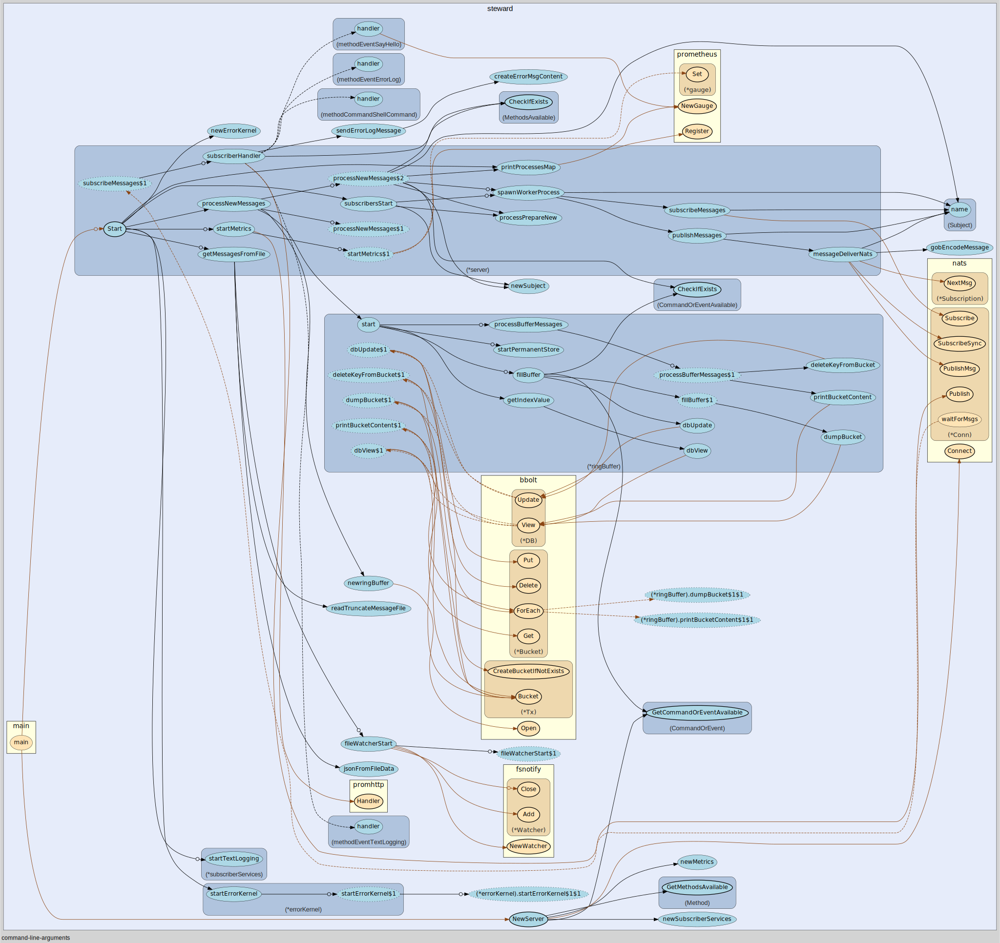

# steward

Command And Control anything asynchronously.

Send shell commands to control your servers by passing a message that will have guaranteed delivery if/when the subsribing node is available. Or for example send logs or metrics from an end node back to a central log subscriber.

The idea is to build and use a pure message passing architecture for the commands back and forth from nodes, with guaranteed delivery. A node can be a server running any host operating system, a container living in the cloud somewhere, a rapsberry pi, or something else that needs to be controlled that have an operating system installed  . The message passing backend used is <https://nats.io>

```text
                                                                             ┌─────────────────┐
                                                                             │                 │
                                                                             │                 │
                                                                             │ ┌────────────┐  │
                                                                             │ │ Edge Unit  │  │
      ┌─────────────────┐                 ┌─────────────────┐                │ └────────────┘  │
      │                 │                 │                 │ ────Event────▶ │                 │
      │  ┌────────────┐ │ ─────Event────▶ │  ┌───────────┐  │ ◀────ACK ───── │                 │
      │  │ Management │ │                 │  │  Message  │  │                └─────────────────┘
      │  │  station   │ │                 │  │  broker   │  │                ┌─────────────────┐
      │  │            │ │                 │  └───────────┘  │                │                 │
      │  └────────────┘ │ ◀─────ACK ───── │                 │ ────Event────▶ │                 │
      │                 │                 │                 │ ◀────ACK ───── │  ┌────────────┐ │
      └─────────────────┘                 └─────────────────┘                │  │ Edge Unit  │ │
                                                                             │  └────────────┘ │
                                                                             │                 │
                                                                             │                 │
                                                                             └─────────────────┘
```

Why ?

With existing solutions there is often either a push or a pull kind of setup.

In a push setup the commands to be executed is pushed to the receiver, but if a command fails because for example a broken network link it is up to you as an administrator to detect those failures and retry them at a later time until it is executed successfully.

In a pull setup an agent is installed at the Edge unit, and the configuration or commands to execute locally are pulled from a central repository. With this kind of setup you can be pretty certain that sometime in the future the Edge unit will reach it's desired state, but you don't know when. And if you want to know the current state you will need to have some second service which gives you that.

In it's simplest form the idea about using an event driven system as the core for management of Edge units is that the sender/publisher are fully decoupled from the receiver/subscriber. We can get an acknowledge if a message is received or not, and with this functionality we will at all times know the current state of the receiving end. We can also add information in the ACK message if the command sent to the receiver was successful or not by appending the actual output of the command.

## Disclaimer

All code in this repository are to be concidered not-production-ready. The code are the attempt to concretize the idea of a purely async management system where the controlling unit is decoupled from the receiving unit, and that that we know the state of all the receiving units at all times.

## Features

- Send a message with some command or event to some node and be sure that the message is delivered. If for example the network link is down, the message will be retried until succesful.

- Error messages can or will be sent back to the central upon failure.

- The handling of all messages is done by spawning up a process for the handling in it's own thread, this allows us for individually keep the state for each message both in regards to ACK an Errors handled all within the thread that was spawned for owning the message (if that made sense ??).

- Processes for handling messages on a host can and might be automatically restarted upon failure, or asked to just terminate and send a message back to the operator that something have gone seriously wrong. This is right now just partially implemented to test that the concept works.

- Processes on the publishing node for handling incomming messages for new nodes will automatically be spawned when needed if it does not already exist.

- Publishing processes will potentially be able to send to all nodes. It is the subscribing nodes who will limit from where and what they will receive from.

- Messages not fully processed or not started yet will be automatically handled in chronological order if the service is restarted.

- All messages processed by a publisher will be written to a log file as they are processed, with all the information needed to recreate the same message.

- All handling down to the process and message level are handled concurrently. So if there are problems handling one message sent to a node on a subject it will not affect the messages being sent to other nodes, or other messages sent on other subjects to the same host.

- Default timeouts to wait for ACK messages and max attempts to retry sending a message specified upon startup. This can be overridden on the message level.

- Report errors happening on some node in to central error handler.

- Message types of both ACK and NACK, so we can decide if we want or don't want an Acknowledge if a message was delivered succesfully.
Example: We probably want an ACK when sending some CLICommand to be executed, but we don't care for an acknowledge (NACK) when we send an "hello I'm here" event.

- Prometheus exporters for Metrics

- More will come. In active development.

## Concepts/Ideas

### Terminology

- Node: Something with an operating system that have network available. This can be a server, a cloud instance, a container, or other.
- Process: One message handler running in it's own thread with 1 subject for sending and 1 for reply.
- Message:
  - Command: Something to be executed on the message received. An example can be a shell command.
  - Event: Something that have happened. An example can be transfer of syslog data from a host.

### Naming

#### Subject

Subject naming are case sensitive, and can not contain the space are the tab character.

`<nodename>.<command/event>.<method>`

Nodename: Are the hostname of the device. This do not have to be resolvable via DNS, it is just a unique name for the host to receive the message.

Command/Event: Are type of message sent. `CommandACK`/`EventACK`/`CommandNACK`/`EventNACK`. Description of the differences are mentioned earlier.\
Info: The command/event which is called a MessageType are present in both the Subject structure and the Message structure. The reason for this is that it is used both in the naming of a subject, and in the message for knowing what kind of message it is and how to handle it.

Method: Are the functionality the message provide. Example could be `CLICommand` or `Syslogforwarding`

##### Complete subject example

For syslog of type event to a host named "ship1"

`ship1.EventACK.Syslogforwarding`

and for a shell command of type command to a host named "ship2"

`ship2.CommandACK.CLICommand
`

## TODO

- FIX so it can handle multiple slices of input for inmsg.txt

- Add config file options to use when starting up the program for options.

- Rename CLICommand to cli

- Make a scraper that first send an EventACK, and the content of the scraping is returned by a node as a new EventACK back the where the initial event originated.

- Go through all processes and check that the error is handled correctly, and also reported back on the error subject to the master supervisor.

- Implement a log scraper method in `tail -f` style ?

- Implement a web scraper method ?

- Encryption between Node instances and brokers.

- Authentication between node instances and brokers.

## Howto

### Build and Run

clone the repository, then cd `./steward/cmd` and do `go build -o steward`, and run the application with `./steward --help`

### Options for running

```text
    -brokerAddress string
      the address of the message broker (default "0")
  -centralErrorLogger
      set to true if this is the node that should receive the error log's from other nodes
  -defaultMessageRetries int
      default amount of retries that will be done before a message is thrown away, and out of the system
  -defaultMessageTimeout int
      default message timeout in seconds. This can be overridden on the message level (default 10)
  -node string
      some unique string to identify this Edge unit (default "0")
  -profilingPort string
      The number of the profiling port
  -promHostAndPort string
      host and port for prometheus listener, e.g. localhost:2112 (default ":2112")
```

### How to Run

On some central server which will act as your command and control server.

`./steward --node="central"`

One the nodes out there

`./steward --node="ship1"` & `./steward --node="ship1"` and so on.

Use the `--help` flag to get all possibilities.

### Sending messages with commands or events

Right now there are to types of messages.

- Commands, are some command you typically want to run on a node, wait for it to finish, get an ACK back with the result contained in the ACK message. Think like running a shell command on some remote host.
- Events, are something you just want to deliver, and wait to get an ACK back that it was delivered succesfully. Think like forwarding logs to some host, you just want to be sure it was delivered.

Both Commands and Events can be either ACK or NACK

The types are

```text
  CommandACK
  CommandNACK
  EventACK
  EventNACK
```

### How to send a Message

Right now the API for sending a message from one node to another node is by pasting a structured JSON object into a file called `inmsg.txt` living alongside the binary. This file will be watched continously, and when updated the content will be picked up, parsed, and if OK it will be sent a message to the node specified.

Currently there is one Command message type for running shell comands and one event message type for sending logs implemented. More will come.

NB: The keys and the predefined values like `CommandACK` are case sensitive.

#### Sending a command from one Node to Another Node

Example JSON for pasting a message of type command into the `inmsg.txt` file

```json
[
    {
        
        "toNode": "ship1",
        "data": ["bash","-c","ls -l ../"],
        "commandOrEvent":"CommandACK",
        "method":"CLICommand"
            
    }
]
```

To send specify more messages at once do

```json
[
    {
        
        "toNode": "ship1",
        "data": ["bash","-c","ls -l ../"],
        "commandOrEvent":"CommandACK",
        "method":"CLICommand"
            
    },
    {
        
        "toNode": "ship2",
        "data": ["bash","-c","ls -l ../"],
        "commandOrEvent":"CommandACK",
        "method":"CLICommand"
            
    }
]
```

To send a message with custom timeout and amount of retries

```json
[
    {
        
        "toNode": "ship1",
        "data": ["bash","-c","netstat -an|grep -i listen"],
        "commandOrEvent":"CommandACK",
        "method":"CLICommand",
        "timeout":3,
        "retries":3
    }
]
```

You can save the content to myfile.JSON and append it to `inmsg.txt`

`cat myfile.json >> inmsg.txt`

The content of `inmsg.txt` will be erased as messages a processed.

#### Sending a message of type Event

```json
[
    {
        "toNode": "central",
        "data": ["some message sent from a ship for testing\n"],
        "commandOrEvent":"EventACK",
        "method":"TextLogging"
    }
]
```

You can save the content to myfile.JSON and append it to `inmsg.txt`

`cat myfile.json >> inmsg.txt`

The content of `inmsg.txt` will be erased as messages a processed.

## Overview


